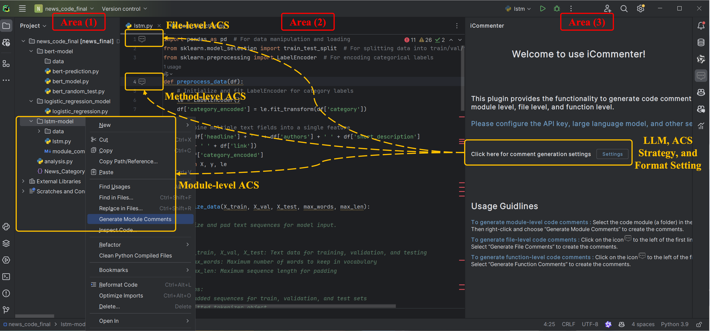

# iCommenter: A Tool for Intelligent Multi-level Code Summarization

## Introduction
Code comments play a huge role in facilitating software development and maintenance. 
Considering that writing comments is a tedious, time-consuming, and labor-intensive task, automated code comment generation (a.k.a. automated code summarization, ACS, for short) has received widespread attention from researchers. 
Although numerous ACS techniques have been proposed, there remains a substantial gap between these techniques and their practical application in supporting software developers. 

To fill this gap, we present a handy intelligent ACS tool named iCommenter based on advanced large language models (LLMs) and crafted summarization strategies. 
iCommenter enables developers to conveniently and automatically generate comments for different levels of code units. 
We design three crafted summarization strategies to ensure the quality of comments generated by iCommenter for multi-level code units. 
To make iCommenter practically support a broad range of software developers, we currently implement it as a plugin for PyCharm, one of the most popular Python integrated development environments (IDEs).

## 🔥 Download & Installation
You can download the iCommenter PyCharm plugin from the following directory in this repository:

📂 **[`plugins/`](./plugins/)** – This folder contains multiple versions of the iCommenter plugin for download.

To install the plugin in PyCharm:
1. Open **PyCharm**.
2. Navigate to **Settings** > **Plugins**.
3. Click **Install Plugin from Disk** and select the downloaded `.zip` file.
4. Restart PyCharm to activate iCommenter.

## 📷 Usage & Guideline
Below is a screenshot showcasing iCommenter in action:

  

### How to Use
- **iCommenter Setting:** After installing iCommenter, developers can first make some custom configurations in area (3), including setting the base LLM, file-level ACS strategy, and expected comment format.
- **Method-level and File-level Comment Generation:** When a developer opens a code file for editing, iCommenter automatically inserts icons () in the code editing area on the left (right next to the line numbers) at the first line of the file code unit and the first line of each method unit. 
When developers would like to generate comments for method-level and file-level code units, they can simply click these icons.
- **Module-level Comment Generation:** When developers want to generate comments for a module-level code unit, they can simply move the mouse to the folder directory corresponding to the module in area (1), then right-click, and select ``Generate Module Comments.'' iCommenter will adopt the hierarchical code strategy to generate comments for the module, and store the generated comments in a file and place it in the module folder for developers to view.

## 🛠 Core Code & Implementation
The core implementation of iCommenter, including various summarization strategies and prompt designs, is available in a separate repository:

🔗 **[iCommenter-Core Repository](https://github.com/wssun/LLM4ModuleSum)** – Contains the main logic for comment generation.

## 📢 Future Work
We are actively working on extending iCommenter to **IntelliJ IDEA**, enabling support for Java developers.

---

For issues, suggestions, or contributions, please open an issue or submit a pull request. Happy coding!

